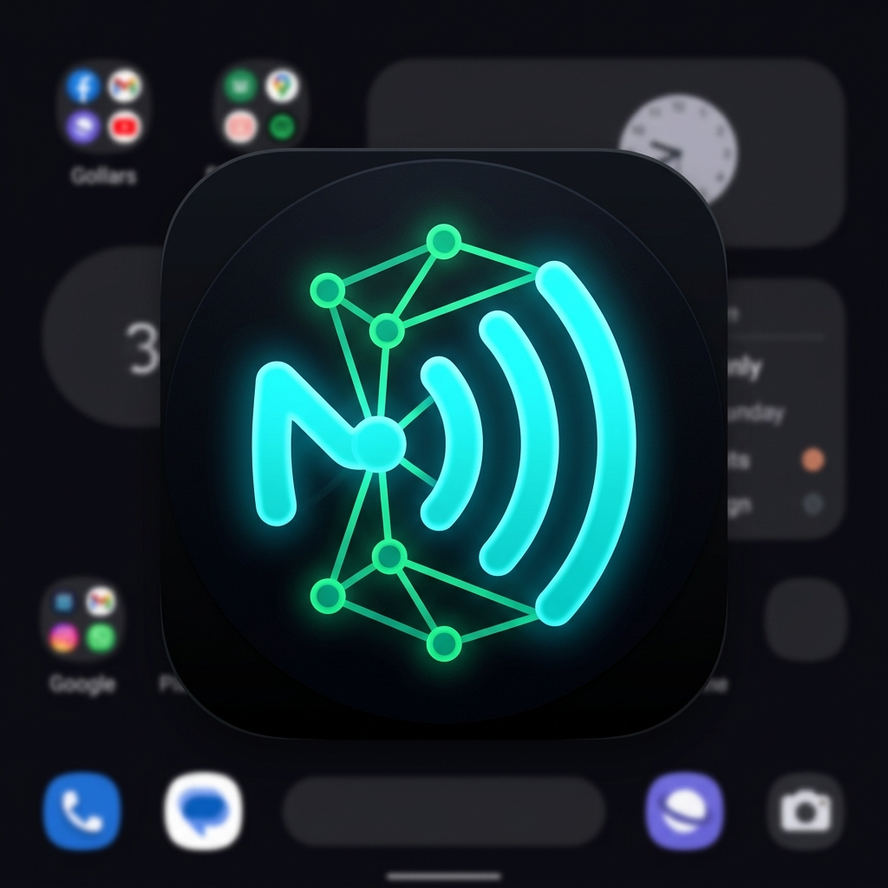

# 📱 NFC Nexus

NFC Nexus is a modern, production-grade Android NFC utility application built with Kotlin and Jetpack Compose. It provides comprehensive tools for reading, writing, managing, and emulating NFC tags. 

<p align="center">
  
</p>

## 🌟 Features

*   **🔍 Read & Inspect**: Deeply inspect NFC tags to view hardware metadata (Tag Type, Technologies, Memory size, UID, ATQA/SAK bytes) and parse NDEF payloads natively.
*   **✍️ Write & Format**: Write Custom NDEF messages (Web Links, Plain Text, Wi-Fi Configs, vCards, App Launchers) or format raw tags. Supports locking tags to Read-Only mode.
*   **💾 Library & History**: Automatically saves your scanned tags and crafted payloads into a local Room Database for quick access later.
*   **📡 Host Card Emulation (HCE)**: Turn your phone into an NFC tag! Emulate saved profiles and NDEF messages to other readers without needing a physical tag. Includes an APDU transaction log for debugging.
*   **🧬 Clone Engine**: Instantly clone an existing tag's payload onto a new tag, or push it straight to the HCE emulator to broadcast it.

## 🛠️ Tech Stack & Architecture

*   **Language**: 100% Kotlin
*   **UI Framework**: Jetpack Compose (Material 3)
*   **Architecture**: MVVM (Model-View-ViewModel) / Clean Architecture
*   **Concurrency**: Kotlin Coroutines & StateFlow
*   **Local Persistence**: Room Database (via KSP)
*   **Target SDK**: Android 15 (API 35), Minimum SDK: Android 8.0 (API 26)
*   **NFC Stack**: `android.nfc` (ReaderMode), ISO-DEP HostApduService (HCE)

## 📥 Download & Install

You can download the latest pre-compiled APK from the [Releases](https://github.com/maorrub/NFC-Nexus/releases/latest) page to install directly on your Android device.

## 🚀 Building from Source

1. Clone the repository:
   ```bash
   git clone https://github.com/maorrub/NFC-Nexus.git
   ```
2. Open the project in **Android Studio**.
3. Sync Gradle and run on a physical Android device (NFC features require real hardware).

## ⚠️ Notes on Host Card Emulation (HCE)

Android OS enforces certain security limitations on HCE:
*   The emulated UID is heavily randomized by Android on every tap to prevent tracking. You cannot emulate static MIFARE UIDs (e.g., hotel key cards or gym fobs).
*   HCE only supports ISO-DEP (ISO 14443-4) protocol.
*   NFC Nexus correctly suspends Android's `ReaderMode` while the Emulate tab is active to prevent hardware conflicts and allow external readers to poll the device.

## 📄 License

This project is open-source and available under the MIT License.
